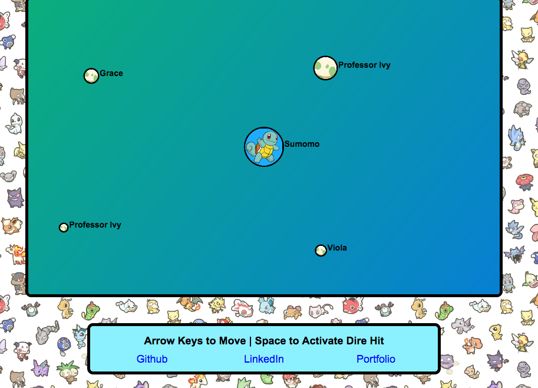
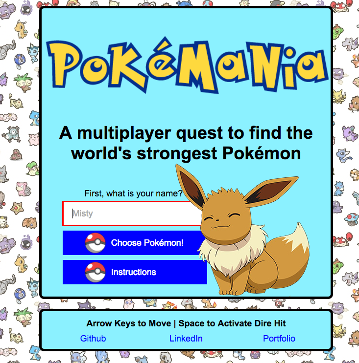

# Pokemania

[Live Version](http://www.pokemania.site)

Pokemania is a multiplayer Javascript game built with a Node.js server and Socket.IO to provide real time updates.

The objective of the game is simple: get as large as you can and don't lose. Your player becomes larger and evolves by defeating other Pokemon. You can defeat another Pokemon if they are smaller than you, or if you activate Dire Hit and run into a larger Pokemon. However, there is a delay for Dire Hit to take effect that gets longer as you grow and evolve. Controls are arrow keys to move and space bar to activate Dire Hit.

## Features & Implementation

### Game Logic

The basic game logic is handled on a server written with Node.js. This takes care of a few basic operations:

* Creating new players (both human and computer)
* Updating player positions based on their velocities
* Handling collisions
* Handling out of bounds players
* Removing inactive human players
* Refilling the game with computer players if needed

This basic game logic lives in the [game file in the server folder](./server/game.js).

### Real Time Updates

While the server handles the game logic, it must communicate enough of the game state to the client so that the game can be rendered on the browser. To implement these updates, I utilized [Socket.IO](https://github.com/socketio/socket.io).

First, I set up the connection as outlined in the Socket.IO documentation:

```javascript
const app = require("http").createServer(handler);
const io = require("socket.io")(app);
const PORT = process.env.PORT || 3000;

app.listen(PORT);

new Sockets(io);
```

In my [Sockets class](./server/sockets.js) I then define what functions should be executed based on client communication, such as when a client connects or indicates that they will move their Pokemon.

```javascript
onSocketConnection(client) {
  client.on("disconnect", () => { this.onClientDisconnect(client); });
  client.on("new player", this.onNewPlayer(client));
  client.on("move player", this.onMovePlayer.bind(this));
  client.on("dire hit player", this.onDireHitPlayer.bind(this));
}
```

On the opposite side of the coin, I also use Socket.IO to notify the client when certain things happen. For example, below is a method that notifies an inactive player that they have been removed from the game. The client then receives this notices and changes the view accordingly (by switching to the sleeping Charizard view). I also send updates of the game state to the client on an interval in a similar fashion. Note that players who disconnect voluntarily (such as by closing the window) are removed immediately from the server.

```javascript
notifyInactivePlayers(inactivePlayerIds) {
  inactivePlayerIds.forEach(inactivePlayerId => {
    this.socket.emit("inactive player", { id: inactivePlayerId });
  });
}
```
### Connecting the Client

When a new client visits the site, I set up the canvas to draw the game on, connect to the server using the Socket.IO API, and initialize a new instance of the [GameView class](client/game_view.js). This allows the server to communicate updates with the client and for the client to see the effects in the browser.

```javascript
document.addEventListener("DOMContentLoaded", () => {
  const canvas = document.getElementById("game-canvas");
  canvas.width = CANVAS_X;
  canvas.height = CANVAS_Y;

  const context = canvas.getContext("2d");
  const socket = io();

  const gameView = new GameView(context, socket);
});
```

### Drawing the Game

When the server sends various updates to the client (such as the game state or notification that an inactive player has been removed), the client then handles them accordingly. The main updates that the game sends are a prompt to redraw the game based on an updated game state, notification that Dire Hit has been activated (with information about how long it will take to take effect), and that an inactive player has been removed.

In terms of the main function of the [client game view class](./client/game_view.js) - drawing the game - I rely on HTML5 Canvas to draw the game state. The server sends the bare minimum information for the client to render the game on their browser (in this case, the position, size, and image URL of each of the players), and the game is then drawn on the canvas. Below is the main game draw method. This method takes an offset that each client calculates to keep a specific player in the center of their game view while moving the rest of the board and players relative to them. In addition, a simple loading screen is rendered instead of the game board in the time between when a client sends a notice to join an game and then when the server game state starts incorporating that player.

```javascript
export const drawGame = (context, offset, players, loading = false) => {
  context.clearRect(0, 0, CANVAS_X, CANVAS_Y);
  context.fillStyle = BG_COLOR;
  context.fillRect(0, 0, CANVAS_X, CANVAS_Y);

  if (loading) {
    drawLoadingScreen(context);
  } else {
    drawGameBoard(context, offset);
    drawPlayers(context, offset, players);
  }
};
```

Below is a screen shot of the game board with several players.


### Start and Restart Screens

In addition to drawing the game on the canvas, I also conditionally render various HTML elements depending on a given client's location in the game cycle: before start, playing the game, restarting after losing, and restarting after being inactive. This rendering is determined by click handlers on various elements, such as the start button to kick off the first game. Below is the code for starting the game as a simple example.

```javascript
addStartClickListener() {
  const startButton = document.getElementById("start-button");

  startButton.onclick = () => {
    this.start();
  };
}
```

Below is a screen shot of the start screen, which is rendered when a player first visits the site.


### Storing Static Assets

Because images are so important to this game, I include a [StaticAssets class](./client/static_assets.js) to load and then store common images (such as the egg and background images) when a player visits the page. In addition, whenever an image that is not loaded initially is later loaded (such as when a player evolves or when a player views the select Pokemon screen), it is also stored in the StaticAssets instance associated with a particular client. This ensures that an image is loaded at most one time. Below is the code to load original images and then notify the game view that images have been loaded so it can draw the game.

```javascript
addImage(url) {
  this.images[url] = new Image();

  this.images[url].onload = () => {
    this.loadedCount++;

    if (this.checkAllLoaded()) {
      this.notifyCallback();
    }
  };

  this.images[url].src = url;
}
```

### Future Directions

* Improve compatibility with Safari and IE
* Garbage collection on client side when players lose
* Multiple servers if the game gets too full
